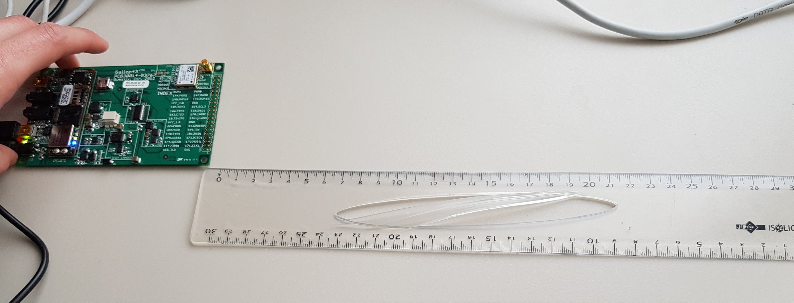

Motion Capture
======
*Your next Wiimote ;)*

**Motion Capture is an on-board computing project for motion capture using accelerometer data.**
The source code is written in C and is compiled for a [Gumxtix controller](https://www.gumstix.com/).
A GUI application on a remote computer lets you observe the motion in real time.

Project description: [Website](https://johan-gras.github.io/projects/motioncapture/)

## How to use
There are two source folders: one for the Gumstix and one for your Linux computer. You need to compile them.
- For the first one, you need to crossbuild the program on your computer Then, you can upload the executable on the device. The main is located inside time.c
- For the second one, you can build the program as usual with GCC. The main is located inside base_opengl.c
